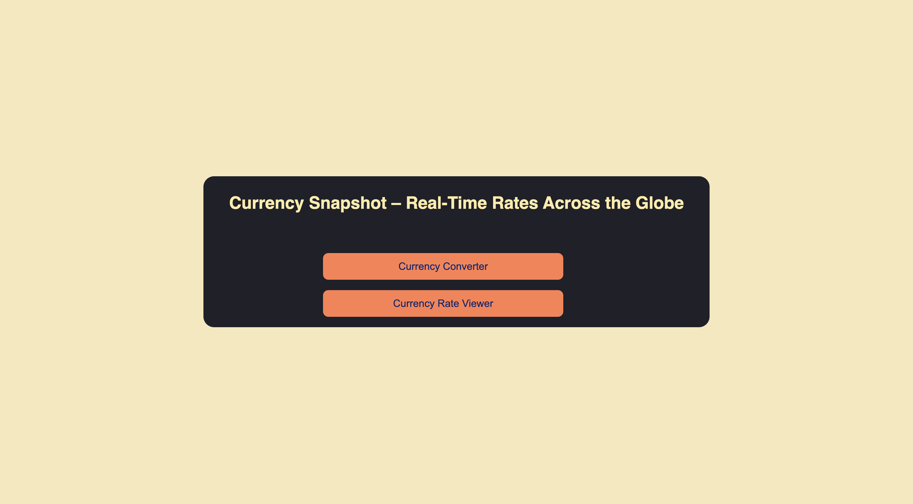
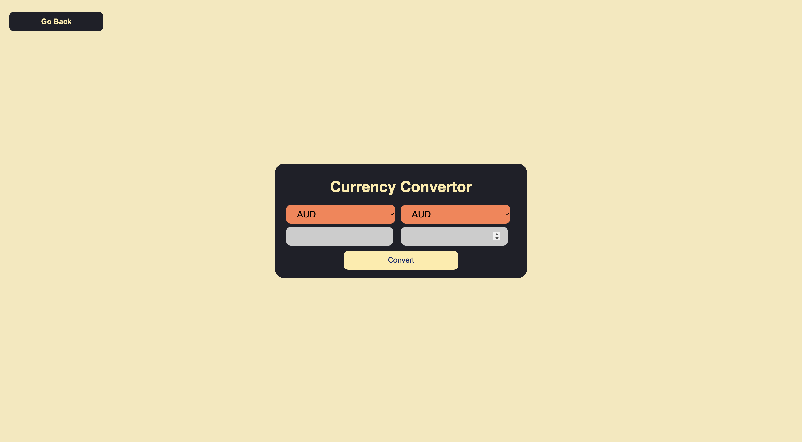
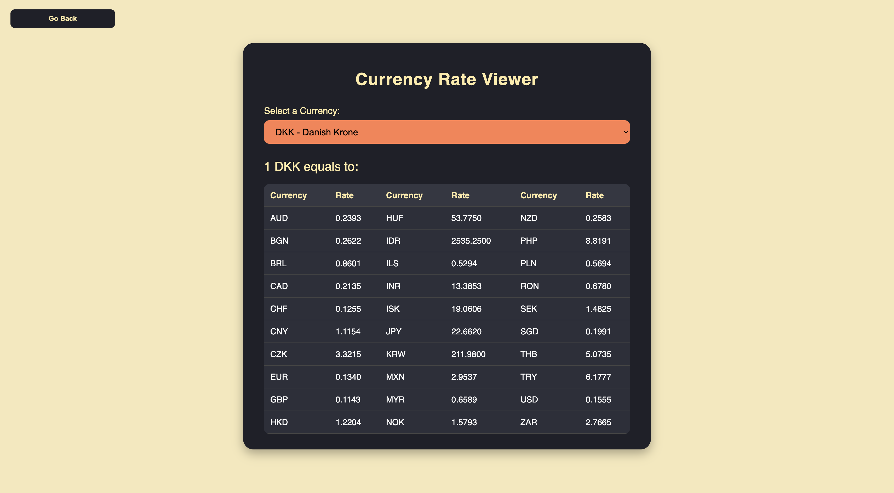

# 💱 Currency Snapshot – Real-Time Currency Tools

A simple, interactive web app offering two major functionalities:
- **Currency Converter** – Convert between currencies using real-time rates.
- **Currency Rate Viewer** – View real-time exchange rates for any selected currency against multiple others.

Built using **HTML**, **CSS**, and **JavaScript** with real-time data from the **Frankfurter API**.

---

## 🔥 Features
- Real-time currency conversion.
- Currency rate table viewer for quick snapshots.
- Two-page navigation:
  - Homepage with options.
  - Currency Converter page.
  - Currency Rate Viewer page.
- Responsive and user-friendly design.

---

## 📂 Project Structure
```
📁 currency-converter/
├── 📁 screenshots       # App screenshot
├── index.html           # Landing page (Home)
├── style.css            # Styles for currency converter
├── home.css             # Styles for homepage
├── viewer.css           # Styles for currency rate viewer
├── app.js               # Core JavaScript logic
└── README.md            # Project documentation
```
---

## 📷 Screenshots

| 🔸 Home Page | 🔸 Currency Converter Page | 🔸 Currency Rate Viewer Page |
|------------|-------------|-----------|
|  |  |  |

---

## 🚀 Technologies Used
- **HTML** – Markup
- **CSS** – Styling and responsive layout
- **JavaScript** – API integration and logic
- **Frankfurter API** – Real-time exchange rates

---

## 📌 API Used

### Frankfurter API
- **Base URL:** `https://api.frankfurter.app`
- **Endpoints used:**
  - Currency conversion:  
    ```
    https://api.frankfurter.app/latest?amount={amount}&from={from}&to={to}
    ```
  - Currency rate snapshot:  
    ```
    https://api.frankfurter.app/latest?from={currency}
    ```

---

## 🛠 How It Works

### Currency Converter:
1. Select currencies and input the amount.
2. Click **Convert** to get the result instantly.

### Currency Rate Viewer:
1. Select a base currency.
2. View exchange rates for that currency against multiple others in a tabular format.

---

## 🧪 Installation & Usage

```bash
git clone https://github.com/Kavin-Antony/Currency_Converter.git
cd currency-converter
# Then open index.html in your browser
```

